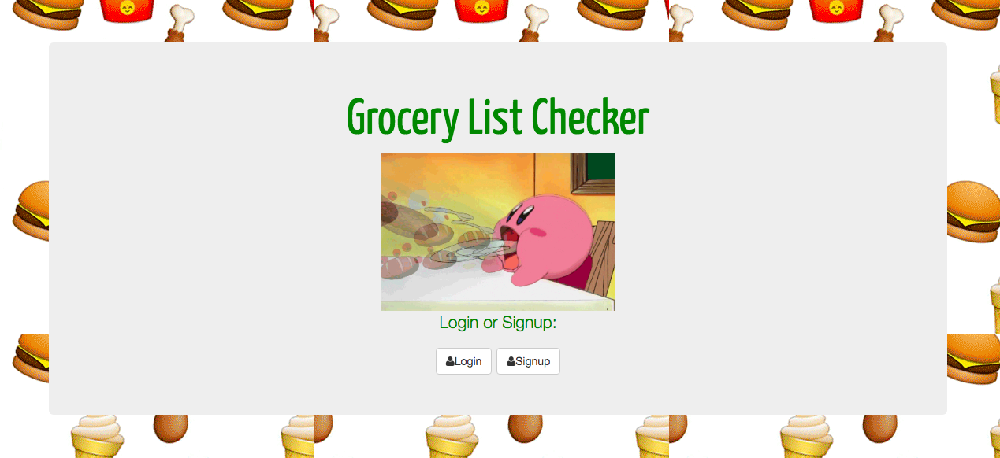

#  Grocery Store Authentication FullStack App
 Build a Fullstack app using user Authentication.

## Installation

1. Clone repo
2. run `npm install`

## Usage

1. run `node server.js`
2. Navigate to `localhost:3000`

## Link To Live Site:
www.kennethscruz.com

## Tech used: HTML,CSS, Javascript (Node), Express

I would like to add a functionality where the user can
offer to get someone elses groceries upon clicking.

## Lessons learned:
It was fun learning to use CRUD functionalities, and User Authentication for privacy matters is important to consider when designing a website.

## Credit

Modified from Scotch.io's auth tutorial
